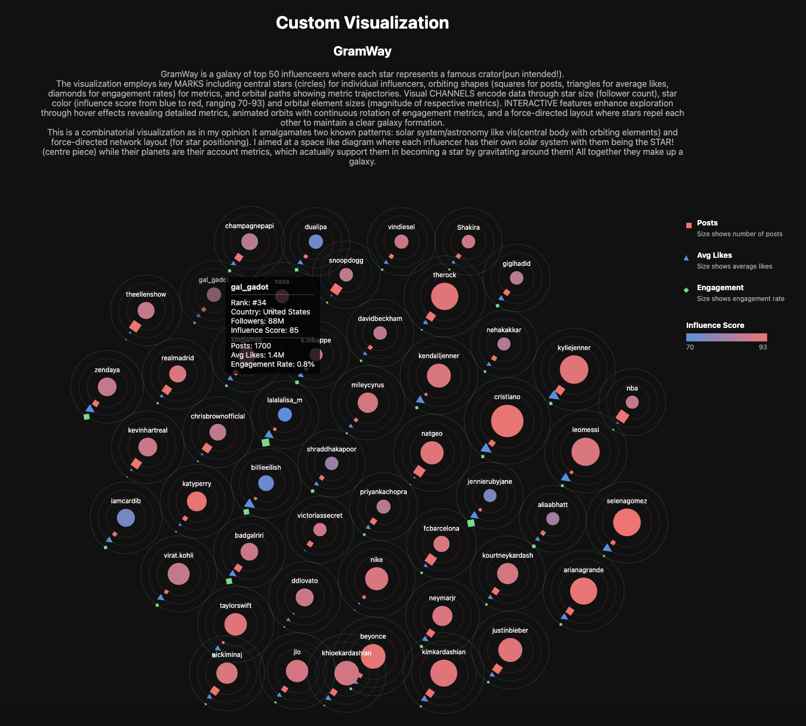

# GramWay: Cosmic Visualization of Instagram Influencers



## Live Demo

Experience the interactive visualization: [GramWay Live Demo](https://rkapoor1999.github.io/GramWay/)

## Overview

GramWay is an interactive data visualization that reimagines Instagram influencers as celestial bodies in a cosmic galaxy. Each influencer is represented as a star system, with their metrics visualized through an astronomical metaphor. This project demonstrates advanced D3.js techniques combined with creative data representation approaches to effectively communicate multi-dimensional social media analytics.

## Features

### Technical Implementation

- **Force-Directed Graph Layout**: Utilizes D3's force simulation to create an organic, galaxy-like arrangement of star systems that prevents overlapping while maintaining aesthetic appeal.
- **Dynamic Data Processing**: Intelligently parses and normalizes heterogeneous social media metrics (handling K, M, B suffixes) for consistent visual representation.
- **SVG-Based Visualization**: Leverages SVG capabilities for complex shape rendering and animations.
- **Custom Gradient Effects**: Implements radial and linear gradients for enhanced visual appeal and information density.
- **Responsive Collision Detection**: Employs advanced collision algorithms to maintain appropriate spacing between star systems based on their size.

### Visual Elements

- **Central Stars**: Circular nodes represent individual influencers.
  - Size encodes follower count (larger stars = more followers)
  - Color gradient from blue to red indicates influence score (brighter/redder = higher influence)
- **Orbital Systems**: Each star has three distinct orbiting objects:
  - **Posts** (Squares): Represent posting frequency
  - **Average Likes** (Triangles): Indicate audience engagement per post
  - **Engagement Rate** (Diamonds): Show the overall 60-day engagement percentage
- **Orbital Paths**: Circular tracks at varying distances from the central star
- **Interactive Legend**: Color-coded explanation of all visual elements

### Interactive Features

- **Tooltip Information**: Hover over any star system to reveal detailed metrics:
  - Rank in the influencer ecosystem
  - Country/region
  - Precise follower count
  - Influence score
  - Post count
  - Average likes
  - Engagement rate
- **Dynamic Animation**: Continuous orbital rotation brings the visualization to life
- **Visual Exploration**: Force-directed layout allows natural clustering of similar influencers

## Design Philosophy

GramWay is a **combinatorial visualization** that merges three established visualization patterns:

1. **Solar System/Planetary Visualization**: Using the metaphor of central bodies with orbiting elements to represent hierarchical relationships
2. **Force-Directed Network Layout**: Employing physical simulation to organize complex data points
3. **Multi-Variate Data Visualization**: Utilizing different shapes, sizes, and colors to encode multiple variables simultaneously

This approach creates an intuitive astronomical metaphor where social media influence becomes cosmic significance. The visualization leverages our innate understanding of celestial systems to make complex social media metrics immediately comprehensible.

## Technical Stack

- **D3.js**: Core visualization library (v7)
- **HTML5/CSS3**: Structure and styling
- **JavaScript (ES6+)**: Data processing and interaction logic

## How to Run

1. Clone the repository:
   ```bash
   git clone https://github.com/yourusername/gramway.git
   cd gramway```
2. Start a local server:
    ```python3 -m http.server [port]```
3. Open in Chrome (recommended browser):
    ```http://localhost:[port]```


### Developed by Raghav Kapoor (rkapoo22@asu.edu)